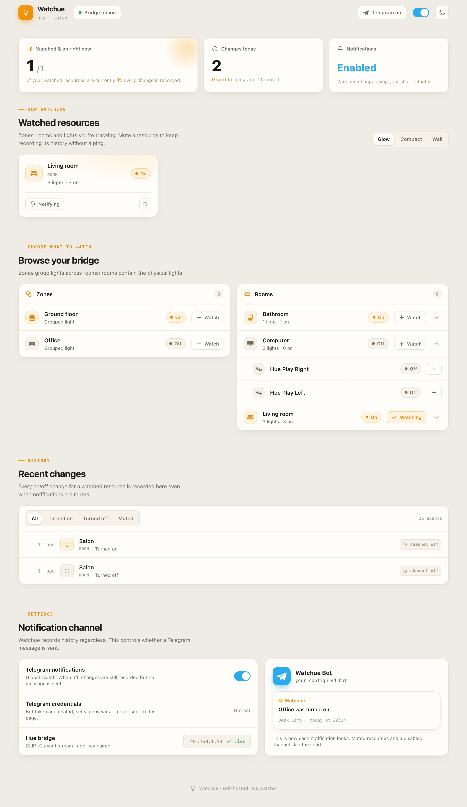
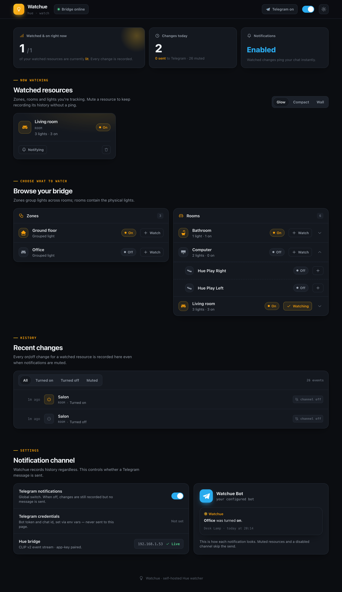

<p align="center">
  
</p>

<p align="center">
  A self-hosted Philips Hue on/off watcher with Telegram notifications.
</p>

<p align="center">
  
  
  
</p>

---

## Overview

Watchue detects when specific Philips Hue zones, rooms or lights are switched on or off,
records the history, and sends a Telegram notification. A web app lets you browse your
bridge, choose what to watch, mute notifications per resource, and review the history —
all updating live as things happen, no page refresh needed.

<p align="center">
  
  
</p>

---

## Features

- **Watch zones, rooms and lights** — pick exactly which Hue resources to track from your
  whole bridge.
- **Telegram notifications** — get pinged the moment a watched resource turns on or off.
- **Per-resource mute** — keep recording a resource's history without being pinged for it.
- **Global notification toggle** — turn the whole Telegram channel off/on without losing any
  history.
- **History** — every on/off change for a watched resource is recorded, even while muted.
- **Live updates** — the dashboard reflects bridge changes in real time over SSE, including
  lights toggled from outside the app (the Hue app, a physical switch, etc.).

---

## Quick Start

### Docker Compose

Save the following as `compose.yml`:

```yaml
services:
  watchue:
    image: ghcr.io/florentsorel/watchue:latest
    container_name: watchue
    ports:
      - "8080:8080"
    volumes:
      - ./data:/data
    environment:
      DB_PATH: /data/watchue.db
      HUE_BRIDGE_HOST: 192.168.1.x
      HUE_APP_KEY: your-hue-app-key
      TELEGRAM_BOT_TOKEN: your-telegram-bot-token
      TELEGRAM_CHAT_ID: your-telegram-chat-id
    restart: unless-stopped
```

Then:

```sh
docker compose up -d
```

Open [http://localhost:8080](http://localhost:8080) in your browser.

> **Pinning a version** — replace `:latest` with a specific release tag (e.g.
> `ghcr.io/florentsorel/watchue:1.2.3`) to avoid unexpected changes on container restart.
> Available tags are listed on the
> [container registry](https://github.com/florentsorel/watchue/pkgs/container/watchue).

---

## Environment Variables

| Variable | Required | Description |
|---|---|---|
| `DB_PATH` | No | Path to the SQLite database file (default: `data/watchue.db`) |
| `HUE_BRIDGE_HOST` | Yes | IP or hostname of your Philips Hue Bridge (e.g. `192.168.1.10`) |
| `HUE_APP_KEY` | Yes | Bridge application key — see below for how to obtain one |
| `TELEGRAM_BOT_TOKEN` | No | Telegram bot token — required if `TELEGRAM_CHAT_ID` is set |
| `TELEGRAM_CHAT_ID` | No | Telegram chat id to notify — required if `TELEGRAM_BOT_TOKEN` is set |

Telegram is entirely optional: leave both variables unset and Watchue will keep recording
history, it just won't send notifications.

### Getting a Hue Bridge app key

The Hue Bridge only hands out an application key after a physical button press:

1. Press the physical link button on your Hue Bridge.
2. Within 30 seconds, call the bridge's pairing endpoint:

   ```sh
   curl -k -X POST https://<HUE_BRIDGE_HOST>/api \
     -H "Content-Type: application/json" \
     -d '{"devicetype":"watchue#homelab"}'
   ```

3. The response contains your app key:

   ```json
   [{ "success": { "username": "your-hue-app-key" } }]
   ```

   Use that value as `HUE_APP_KEY`.

### Setting up Telegram notifications (optional)

Skip this section if you don't want notifications — Watchue works fine with no bot configured,
it just won't send anything.

1. Create a bot via [@BotFather](https://t.me/BotFather) and grab its token.
2. Message your new bot (or add it to a group), then call
   `https://api.telegram.org/bot<token>/getUpdates` to find your chat id.
3. Set `TELEGRAM_BOT_TOKEN` and `TELEGRAM_CHAT_ID` — both are required together.

---

## Data

Watchue writes its SQLite database under the mounted volume:

```
data/
└── watchue.db
```

Application logs (startup, bridge connection, event handling) are written to **stdout**.

### Log rotation

Since logs go to stdout rather than a file in the volume, rotate them via Docker's own logging
driver instead of `logrotate` — add this to your `compose.yml`:

```yaml
    logging:
      driver: json-file
      options:
        max-size: "10m"
        max-file: "5"
```
